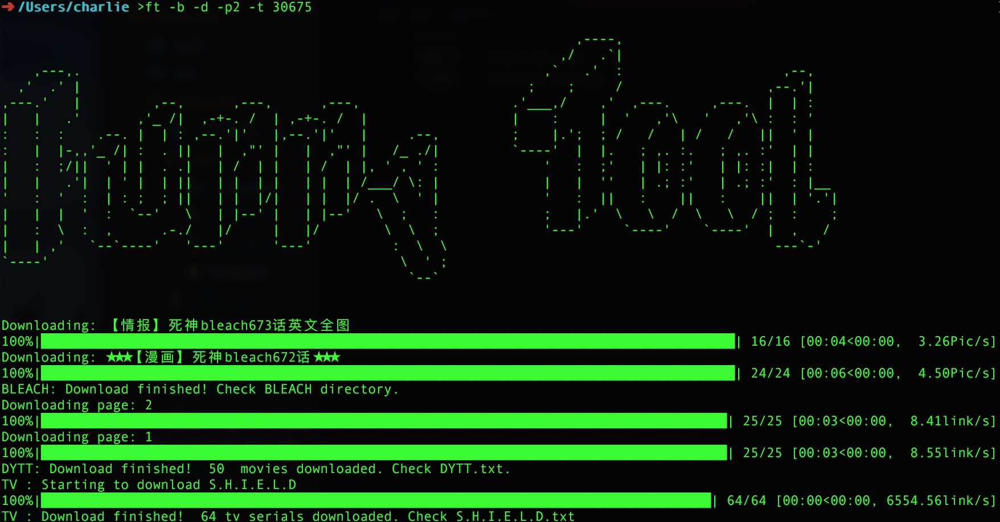

Funny tools for downloading movies, tv serials and BLEACH comics
-----------------


## Introduction
   - Automatically download movie links of latest movies from 电影天堂(http://www.ygdy8.net).
   - No link will be downloaded twice according to latest id in log file.
   - Automatically download latest comics BLEACH from __BLEACH__ __Baidu__ __Tieba__.
   - Comics will be saved in __BLEACH/[Name]__ in current directory.
   - No comics will be downloaded twice according to existence of __BLEACH/[Name]__.
   - Automatically download TV serials from 人人影视 with given ID.
   
## Requirement

__Python 3__

## Usage

- Command line

```
pip3 install funny_tool
```

```
usage: ft [-h] [-b] [-d] [-p PAGE] [-t TV] [-l]

funny_tool: Download movies, tv serials and comics!

optional arguments:
  -h, --help            show this help message and exit
  -b, --bleach          Download BLEACH.
  -d, --dytt            Download latest movies from dytt.
  -p PAGE, --page PAGE  pages to retrieve when downloading movies from dytt,
                        should be used with -d.
  -t TV, --tv TV        Download TV serials by giving ID, use flag -l to check
                        IDs.
  -l, --list            TV serials list.
```

- Python lib

```
import funny_tool

funny_tool.bleach()
funny_tool.dytt()
funny_tool.dytt(2) # retrieve 2 pages
funny_tool.tv(30675)  # Shield
funny_tool.tvlist()
```

## TODO

- Config management
- unit test

## License

MIT

